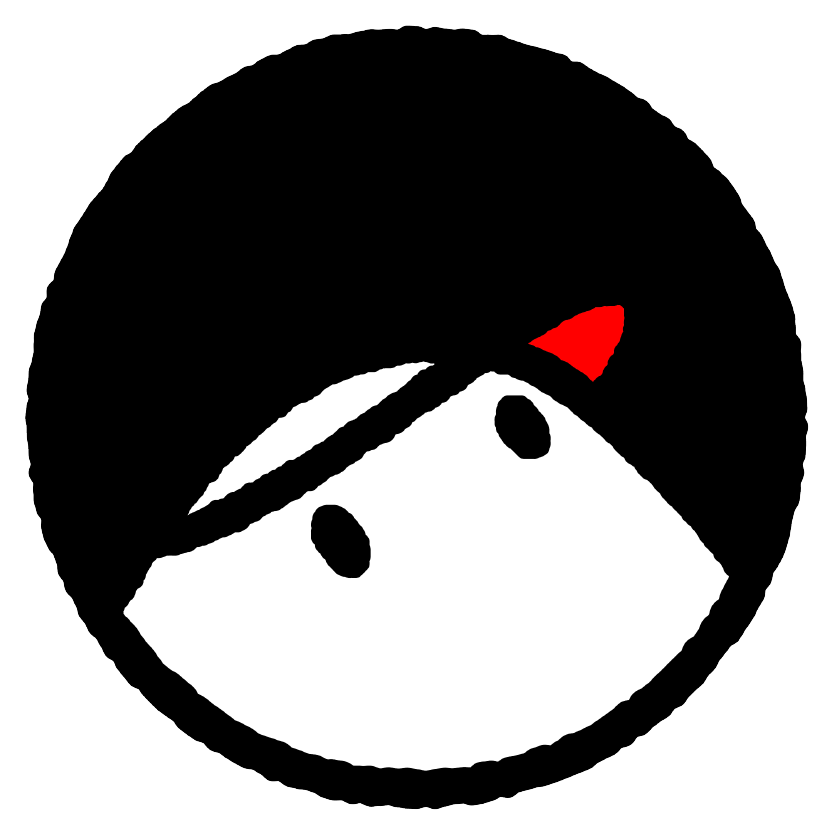

# 

The source code for the client side of Khalid Komics site

___

## Table of Content

1. [About the project](#about-the-project)
2. [Getting Started](#getting-started)
    - [Prerequisites](#prerequisites)
    - [Installation](#installation)
    - [Running](#running)
3. [Contributing](#contributing)
4. [License](#license)

## About the project

Th NextJS web client for Khalid Komics

### Built with

- [Next.js](https://nextjs.org/)
- [Tailwind CSS](https://tailwindcss.com/)

We recommend taking a look at the [documentation](https://nextjs.org/docs/getting-started)

## Getting Started

To get a local copy up and running follow these simple steps.

### Prerequisites

1. Download and install the latest version of Node.js from [here](https://nodejs.org/en/download/).

### Installation

1. Clone the repo

```sh
git clone https://github.com/thamudi/khalidkomics
```

2. Install the dependencies with `npm`, `yarn` or `pnpm`

```sh
cd web-portal

npm install
```

### Running

#### Development

1. To run the project locally for development proposes

```sh
npm run dev
```

2. Go to `http://localhost:3000`

#### Production

1. Build the project

```sh
npm run build
```

2. Launce the project production server

```sh
npm run start
```

profit!

## Contributing

- __Latest work will be on development branch__

1. Clone the Project
2. Create your Feature Branch (`git checkout -b feature/AmazingFeature`)
    - __Note: Make sure to checkout from development before you work on your feature__
3. Commit your Changes (`git commit -m 'Add some AmazingFeature'`)
4. Push to the Branch (`git push origin feature/AmazingFeature`)
5. Open a Pull Request

## License

Distributed under the Apache License 2.0. See [LICENSE](LICENSE) for more information.

___

[Staging Site](https://web.dev.dev-terminal.com)
